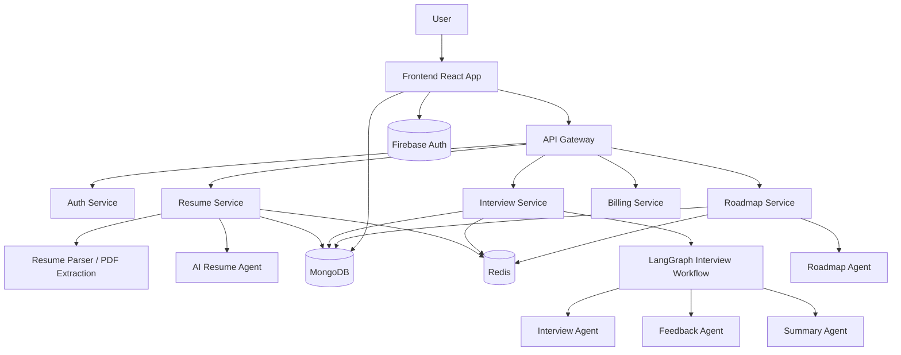
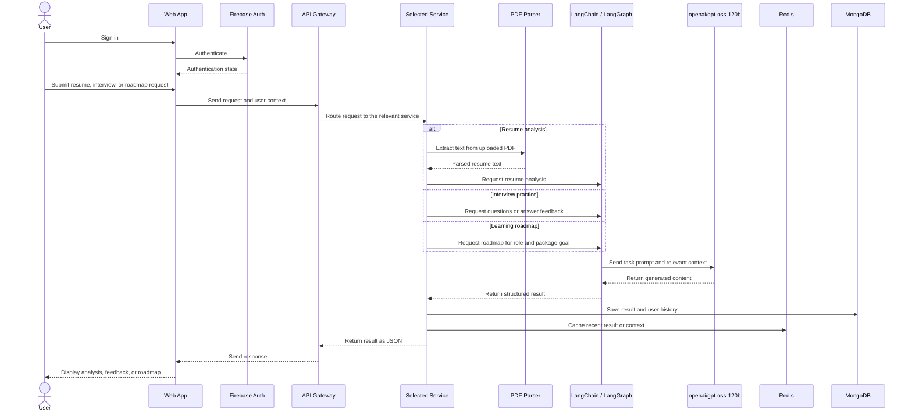

# CareerCoach

AI-powered interview preparation and career readiness platform for freshers.

## 1. Project Name

CareerCoach

## 2. Problem Statement

Fresh graduates often struggle to convert theoretical knowledge into interview-ready skills. They face multiple challenges at the same time:

- Lack of realistic mock interviews tailored to their target role
- Unclear understanding of how recruiters evaluate resumes and technical answers
- Weak feedback loops after practice interviews
- No personalized roadmap to improve skills for a specific job profile or salary target
- Limited access to affordable, structured interview coaching and career guidance

Most existing tools are either generic, expensive, or not tailored to Indian fresher hiring patterns. There is a clear gap between classroom learning and actual hiring expectations.

## 3. Project Overview

CareerCoach is a multi-agent AI platform designed to help freshers prepare for jobs by combining resume intelligence, role-based mock interviews, real-time scoring, and personalized learning roadmaps. The system aims to give users a guided career prep workflow that feels like a personal interview coach, technical mentor, and roadmap planner in one place.

The project focuses on creating a practical AI-assisted ecosystem for job preparation rather than a static chatbot. It combines multiple AI-driven services to analyze resume quality, simulate interviews, evaluate responses, and recommend a clear path toward role-specific improvement.

## 4. Proposed Solution

CareerCoach introduces an AI-powered preparation stack that helps users:

- Upload and analyze resumes using AI-based extraction and evaluation
- Choose interview types such as HR and technical interviews
- Practice interviews with dynamic AI-generated questions
- Receive evaluation, feedback, and summary reports after every answer
- Track performance through dashboards and interview history
- Generate personalized learning roadmaps based on role and target package

Instead of a single generic assistant, the platform uses specialized AI agents to handle different stages of the journey: resume analysis, interview question generation, feedback generation, and roadmap planning.

## 5. Objectives

The project aims to achieve the following goals:

1. Help freshers practice realistic interviews for common job roles.
2. Provide actionable feedback instead of generic answers.
3. Convert resume data into structured skill and gap analysis.
4. Generate a role-specific learning roadmap aligned with salary goals.
5. Reduce the gap between self-preparation and recruiter expectations.
6. Build a scalable AI-assisted career platform that can be extended to broader recruitment and upskilling use cases.

## 6. Target Users / Use Case

### Primary Target Users

- College students preparing for campus placements
- Fresh graduates applying for software roles
- Career switchers entering tech-related job markets
- Students needing structured interview preparation and role guidance

### Use Cases

- A fresher wants to practice a technical interview for a backend engineer role.
- A student uploads a resume and wants AI to identify missing skills and weak sections.
- A user wants a roadmap to reach a target package such as 20 LPA or 30 LPA.
- A candidate wants detailed feedback after answering interview questions.

## 7. Open-Source AI Technology Selected

The project uses the following open-source AI ecosystem and supporting technologies:

- openai/gpt-oss-120b (open-weight reasoning model used for interview coaching, evaluation, and roadmap generation)
- LangChain for prompting and LLM orchestration
- LangGraph for multi-step agent workflows and graph-based execution
- Redis for fast caching and session optimization
- MongoDB for storing interview records, resumes, and learning progress
- Firebase Authentication for login and user state management

This combination allows the project to build a real AI agent-based interview system with meaningful orchestration, not just a basic API wrapper.

## 8. Why This Technology Was Selected

### openai/gpt-oss-120b

This model was selected because it is strong at reasoning, instruction following, and structured output generation, which is critical for:

- generating role-specific interview questions
- evaluating answers with feedback
- creating summary reports and recommendations
- generating a tailored learning roadmap

### LangChain + LangGraph

These frameworks were chosen to model the application as a workflow-driven system:

- interview initiation
- answer evaluation
- completion detection
- summary generation
- roadmap generation

This makes the system modular, explainable, and easier to scale with more agents or tools later.

### Redis and MongoDB

These database and cache layers are necessary for performance and persistence:

- Redis caches recent user data and reduces repeated queries
- MongoDB stores structured records such as resume metadata, interview history, and roadmap results

## 9. AI's Role in the System

AI is not a decorative feature in this project; it acts as the decision engine across the full user journey.

AI responsibilities include:

- Parsing resume content and identifying strengths, missing skills, and ATS gaps
- Generating well-structured role-specific interview questions
- Evaluating candidate responses against expected quality, clarity, and technical depth
- Producing performance summaries and improvement suggestions
- Personalizing a career roadmap based on role, package target, and resume data

The AI system is designed to behave like a coach rather than a generic chatbot, making it more useful and credible for actual hiring preparation.

## 10. System Architecture

## 11. Component-Level Architecture

### Frontend

- Built using React + Vite
- Handles dashboard, login, resume management, interview workflows, roadmap generation, and billing screens
- Provides responsive UI for freshers and career prep tasks

### Backend Gateway

- Central entry point for routing traffic across services
- Provides a unified API layer and request forwarding

### Auth Service

- Manages login/logout
- Integrates with Firebase authentication
- Stores user-specific context and session state

### Resume Service

- Accepts uploaded resume PDFs
- Extracts text from PDF files
- Sends parsed resume content to the AI model
- Saves structured resume skills and recommendations to MongoDB

### Interview Service

- Starts interview sessions
- Generates HR/technical interview questions based on role and type
- Stores answers and progress
- Evaluates each response
- Produces final summary, strengths, weaknesses, and recommendations

### Roadmap Service

- Accepts role and package target
- Uses resume context and role information to generate a detailed learning roadmap
- Stores results for user access and history

### Billing Service

- Handles premium/digital usage-related flows such as coin-based or subscription-related operations

## 12. Data / Information Flow

## 13. Agentic Workflow (if applicable)

The project follows a multi-agent workflow pattern where each AI agent is responsible for a dedicated part of the journey.

### Interview Workflow

1. User selects interview type and role.
2. Interview service triggers the interview agent.
3. AI generates a list of relevant questions.
4. User answers each question one by one.
5. Feedback agent evaluates the answer.
6. If the interview is complete, summary agent creates a final performance report.
7. Results are stored for dashboard analytics and future review.

### Roadmap Workflow

1. User enters target role and package goal.
2. Roadmap service uses role context and optional resume context.
3. AI generates a plan covering learning priorities, milestones, and next steps.
4. The system stores the roadmap and shows it in a structured format.

## 14. Technology Stack

| Layer | Technology |
|---|---|
| Frontend | React, Vite, Tailwind CSS, Redux |
| Routing & UI | React Router, Framer Motion |
| Backend API | Node.js, Express |
| AI Orchestration | LangChain, LangGraph |
| LLM | openai/gpt-oss-120b |
| Database | MongoDB |
| Caching | Redis |
| Authentication | Firebase Auth |
| PDF Parsing | PDF extraction utilities |
| Payment/Monetization | Razorpay |
| Containerization Support | Docker |

## 15. Expected Features

- Resume upload and PDF parsing
- AI-powered resume evaluation and skill gap detection
- HR interview simulation
- Technical interview simulation
- Answer-by-answer feedback and scoring
- Interview status tracking and analytics
- Personalized job roadmap generation
- Role and salary-targeted learning paths
- Dashboard with interview history and performance insights
- user authentication and session management

## 16. Implementation Approach

The project will be implemented in a modular microservice style to keep the system maintainable and extensible.

### Phase 1: Core Product Setup

- Initialize frontend, gateway, and service architecture
- Set up MongoDB, Redis, and Firebase authentication
- Build user profile and session handling

### Phase 2: Resume Intelligence

- Add uploaded PDF support
- Extract text and pass to AI model
- Save resume metadata and recommendations

### Phase 3: Interview Engine

- Create prompt templates for technical and HR interviews
- Implement graph-based interview workflow
- Add answer evaluation and final report generation

### Phase 4: Roadmap Builder

- Combine user role and resume data to generate action plans
- Format roadmap results into readable learning sequences

### Phase 5: Dashboard and Analytics

- Display metrics such as interview totals, scores, and completion trends
- Create overview screens that help users track improvement over time

## 17. Expected Final Output

The final implementation is expected to deliver:

- a web application where users can log in and manage career prep sessions
- AI-driven mock interviews for freshers
- detailed custom feedback and summary reports
- resume analysis and skill suggestions
- personalized roadmap based on role and target package
- a polished dashboard to monitor performance and progress

This creates a practical and valuable platform rather than a simple chatbot interface.

## 18. Future Scope / Scalability

The project is designed to scale into a broader job-prep ecosystem.

Possible future additions include:

- coding interview simulations with live code execution
- voice-based interview practice
- domain-specific interview modes such as DSA, frontend, backend, DevOps, and data roles
- multi-language support
- company-specific mock interviews
- recruiter feedback simulator
- AI-generated portfolio suggestions and project recommendations
- recommendation engine for learning resources and internships

By designing the architecture as service-oriented and AI-agent-driven, additional intelligence modules can be added without major restructuring.

## 19. Open-Source Dependencies / Components

The project depends on and integrates the following open-source tools and libraries:

- React
- Vite
- Node.js
- Express.js
- MongoDB
- Redis
- LangChain
- LangGraph
- openai/gpt-oss-120b (open-weight model)
- Firebase Admin / Firebase Auth
- Tailwind CSS
- Docker
- Razorpay SDK (for payment workflows)

These components form the base architecture and are all relevant to the final system.

## 20. Expected Challenges and Mitigation

### Challenge 1: LLM Output Variability

AI responses may sometimes be inconsistent or less structured.

Mitigation:
- Use strict prompt templates
- Define output schemas clearly
- Enforce JSON parsing and validation
- Add fallback logic when responses fail

### Challenge 2: Resume Parsing Quality

PDFs can vary widely in format, structure, and content quality.

Mitigation:
- Standardize extraction flow
- Clean extracted text before AI processing
- Add post-processing for missing or malformed fields

### Challenge 3: Role-Specific Interview Quality

Generic prompts may not reflect real-world recruiter expectations.

Mitigation:
- Use role-aware prompts and skill-specific evaluation logic
- Include resume context and target job profile in prompts

### Challenge 4: Scalability and Performance

Large numbers of users can increase processing and caching pressure.

Mitigation:
- Use Redis for caching repetitive data
- Keep services modular
- Add asynchronous processing for heavier AI operations when needed

### Challenge 5: User Trust and Actionability

Users may ignore advice if the feedback is too generic.

Mitigation:
- Generate structured recommendations grounded in resume data and interview answers
- Tie suggestions to measurable skill gaps and improvement priorities

## Summary

CareerCoach is a practical AI-driven platform for interview preparation, skill evaluation, and career roadmap generation. It addresses a real problem faced by freshers: the lack of structured, personalized, and affordable preparation tools. By using open-source AI technologies and a modular architecture, the platform demonstrates meaningful integration of AI in a way that is both useful and scalable for future growth.

This README is designed to match the expectations of the Hacktober Fest Open Source AI Hackathon qualifier by clearly documenting the problem, solution, architecture, AI strategy, and implementation plan.
